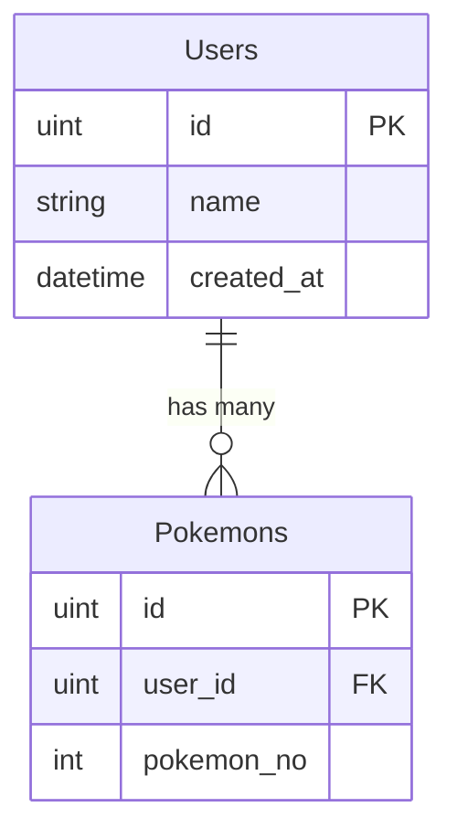

# System Design Skill

このスキルは、PRD（要件定義書）が承認された後、実際のコーディング（`go_ddd` への移行）を開始する前に行うべき「システム設計」のガイドラインです。

## 設計プロセスのステップ

実装計画（`implementation_plan.md`）の作成時、または専用の設計アーティファクト作成時に以下の要素を必ず定義してください。

### 1. データモデリング（DBスキーマ・GORM）
新しいデータを保存する必要がある場合、ER図とGORMモデルの設計を明確にします。
- Mermaidを使用して、新しい・または変更されるテーブルのER図を作成する。
- 各カラムの型、制約（NOT NULL, UNIQUE）、インデックス、外部キー制約を定義する。
- 物理削除か論理削除（`gorm.DeletedAt`）かを明記する。

**Mermaid ER図の例:**

### 2. API設計
エンドポイントを追加・変更する場合、以下を定義します。
- HTTPメソッドとパス（例: `POST /api/pokemon/catch`）
- リクエストパラメータ（パス、クエリ、ボディのJSON構造・バリデーションルール）
- レスポンスのJSON構造と、成功時・失敗時のHTTPステータスコード

### 3. ドメインモデル設計
DBのスキーマ（Infrastructure層の都合）と、ビジネスロジックで利用する純粋なドメインモデル（Domain層の実装）の差分を吸収するため、それぞれの構造体をプロットします。

## 注意事項
- ユーザーに技術的負債やアーキテクチャ上のトレードオフが発生する場合は、必ず警告（GitHubアラートの `> [!WARNING]` 等）を用いて説明し、判断を仰いでください。
- すべての設計定義は `implementation_plan.md` 内に含めるか、大規模な場合は `design_doc.md` アーティファクトとして作成しレビューを求めてください。
