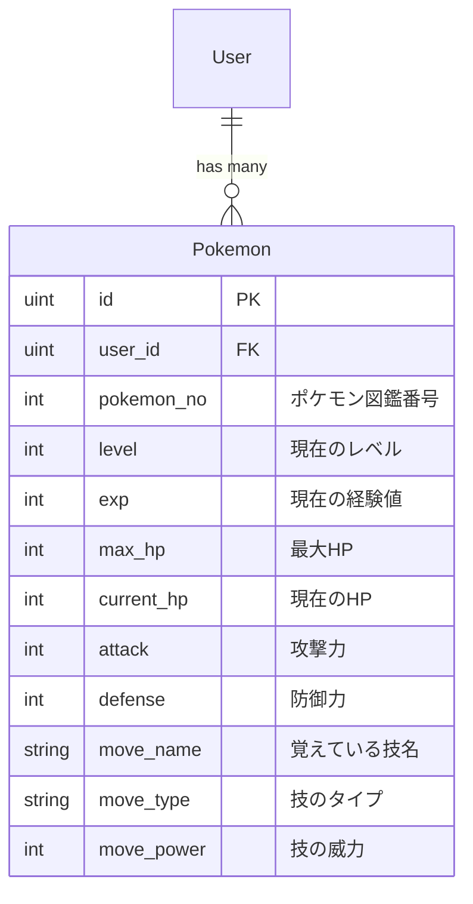

# バトル機能実装計画書 (Implementation Plan)

## 1. 概要
PRDに基づき、NPCトレーナーとのターン制バトル機能を実装する。
ポケモンのステータス保存、わざの継承、タイプ相性計算、レベルアップ機能を段階的に導入する。

## 2. データベース設計 (ER図)

## 3. 実装ステップ

### Phase 1: データモデルとインフラの拡張
1.  **Domain Model**: `internal/domain/model/pokemon.go` に新フィールドを追加。
2.  **Persistence**: `internal/infrastructure/persistence/db.go` の `Pokemon` 構造体を更新し、`AutoMigrate` でカラムを追加。変換関数（`ToDomain`, `FromDomainPokemon`）も更新。
3.  **External API**: `internal/infrastructure/external/pokeapi_repository.go` を更新し、`GetPokemonMetadata` で `Stats` と `Moves` を取得・ランダム選出するように拡張。

### Phase 2: バトルロジックの実装 (Domain & Application)
1.  **Domain Service**: `internal/domain/service/battle_service.go` を新規作成。
    - ダメージ計算（タイプ相性込み）。
    - 経験値獲得とレベルアップ判定（ステータス上昇ロジック）。
2.  **Application UseCase**: `internal/application/usecase/battle_usecase.go` を新規作成。
    - バトルの開始（敵ポケモンの生成）。
    - ターンの進行処理。

### Phase 3: UI/UXの構築
1.  **Handler**: `internal/ui/handler/battle_handler.go` を新規作成。
    - `GET /battle`: バトル開始・表示。
    - `POST /battle/turn`: ターン実行（わざ使用）。
2.  **Template**: `templates/battle.html` を新規作成。
    - HPバー、対峙するポケモンの画像、メッセージログ、コマンドボタン。
3.  **Aesthetic**:
    - CSSアニメーション（ダメージ時の震えなど）。
    - 勝利時のレベルアップ演出。

## 4. API定義

### `GET /battle?my_pokemon_id=1`
- **概要**: 指定した自分のポケモンでバトルを開始する。
- **レスポンス**: HTML（バトル画面）。

### `POST /battle/turn`
- **パラメータ**: `action` (string), `my_pokemon_id` (uint), `enemy_id` (string/uint)
- **レスポンス**: バトル状態の更新を含むHTMLまたはJSON（今回はシンプルにHTML遷移で対応）。

## 5. テスト計画
- [ ] タイプ相性計算の単体テスト。
- [ ] 捕獲時のわざランダム選出が正常に動作するか。
- [ ] HPが0になった際に正常に勝敗が決まるか。

## 6. ＋アルファのWOW提案
- レベルアップ時にステータスバーが動的に伸びる演出を `static/js/battle.js` で実装。
- タイプ相性が「こうかは ばつぐん」の際にテキストを大きく表示。
